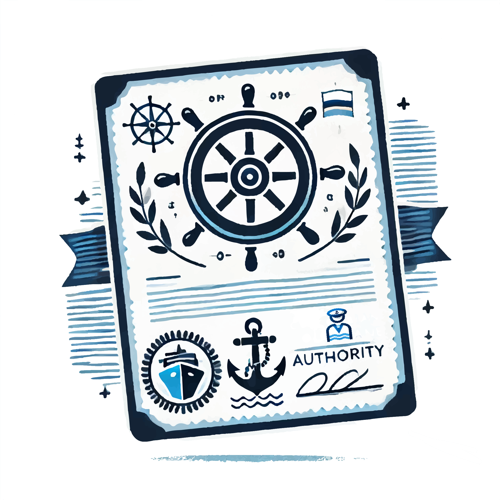
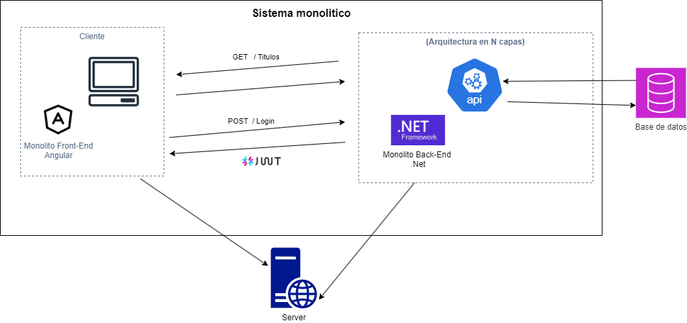
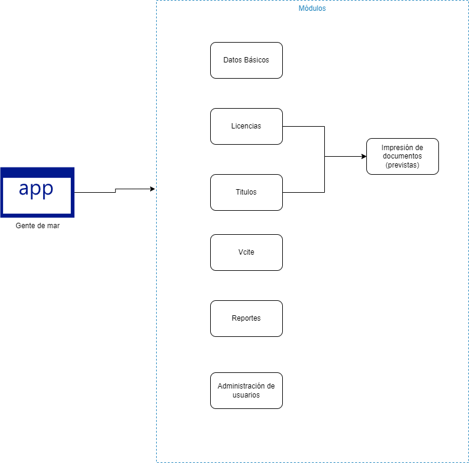

# GenteDeMar

## ¿Qué es GenteDeMar? 
sistema de información electrónico y en línea que permite registrar y mantener actualizada, controlada y validada la información de toda la gente de mar Colombiana con titulos de navegación y licencias

## Infraestructura

La arquitectura representada en la imagen es de un sistema monolítico que utiliza una arquitectura de N capas para organizar sus componentes en el backend. A continuación se detallan los principales elementos y su interacción:

### Cliente (Front-End Monolítico en Angular):
La capa de cliente es una aplicación monolítica desarrollada en Angular, que gestiona la interfaz de usuario y la interacción directa con los usuarios.
El cliente envía peticiones HTTP al backend a través de servicios REST (por ejemplo, GET para obtener títulos y POST para el inicio de sesión).
Se utiliza JWT (JSON Web Token) para la autenticación, lo cual indica que las solicitudes autenticadas llevan un token que el backend valida antes de otorgar acceso a los recursos.

### Back-End Monolítico en .NET:
El backend está desarrollado en .NET Framework, organizado en una arquitectura en N capas. Esto sugiere la separación de responsabilidades, con capas como presentación, lógica de negocio, y acceso a datos.
El backend implementa servicios API que manejan las solicitudes del cliente, interactuando con la base de datos para responder a las peticiones (GET /Titulos, POST /Login, etc.).
La lógica de autenticación y autorización también se maneja en el backend, utilizando JWT para validar los tokens proporcionados por el cliente.

### Base de Datos:
La base de datos se encuentra separada del backend, pero conectada a través de la capa de acceso a datos.
Almacena la información del sistema y responde a las consultas realizadas por el backend para obtener y gestionar los datos requeridos.

### Servidor:
El servidor hospeda tanto el frontend como el backend del sistema monolítico, lo que significa que ambas partes están desplegadas y ejecutadas en el mismo entorno físico o virtual.
Esta configuración es común en sistemas monolíticos, donde todos los componentes están en una única instancia de despliegue.

## Módulos

* Datos Básicos:
Este módulo es el encargado de gestionar la información personal y esencial de los usuarios, como nombres, apellidos, fecha de nacimiento, identificación, entre otros datos que forman el perfil básico de cada individuo registrado en la aplicación.

* Licencias:
En este módulo se administra la gestión de licencias de los usuarios, las cuales pueden incluir permisos para operar o autorizaciones especiales relacionadas con sus cargos. Además, tiene una conexión directa con el módulo de Impresión de Documentos (previstas), lo que permite la generación de documentos imprimibles, como licencias físicas.

* Títulos:
Este módulo maneja la gestión y administración de los títulos que poseen los usuarios, tales como títulos de navegación necesarios para sus cargos. También está integrado con el módulo de Impresión de Documentos (previstas), lo que facilita la impresión de títulos de navegación.

* Vcite (Verificación de Carencia de Informes por Tráfico de Estupefacientes):
Este módulo está diseñado para verificar que los usuarios no tengan registros o antecedentes relacionados con el tráfico de estupefacientes. Su funcionalidad de control y verificación es esencial para la emisión de ciertas licencias o títulos dentro del sistema.

* Reportes:
En el módulo de reportes se generan informes con filtros personalizados para los módulos anteriores. Esto permite que los administradores o usuarios autorizados puedan ver información relevante sobre licencias otorgadas, títulos, entre otros datos. Este módulo incluya opcióm de exportar en formato .csv para análisis externo.

* Administración de Usuarios:
Este módulo permite gestionar las cuentas y accesos de los usuarios dentro de la aplicación. Aquí se pueden crear, editar o anular usuarios, asignar roles, y controlar el acceso a los distintos módulos según el nivel de autorización de cada usuario.

## Descripción del repositorio

Todo el contenido se encuentra en este mismo repositorio esto es así para una mayor facilidad a la hora de ver cómo funcionan las diferentes herramientas.

Puedes encontrar el código dentro de la carpeta `src`. Donde encontrarás múltiples carpetas.

Nota: Técnicamente cada carpeta representa un dominio
* DIMARCore.Solution
    * Api: Capa de abstracción de una API.
    * Business: Capa de abstracción de la logica de negocio.
    * Repositories: Capa de abstracción de los repositorios para la conexión a la bd y las transacciones a cada entidad.
    * UIEntities: Capa de abstracción de las clases DTO para la transferencia de los objetos en la logica de negocio.
    * Utilities: Capa de abstracción que contiene metodos y clases que son reutilizables comunes y necesarios para la aplicación.
* GenteMarCore
    * Entities: Capa de abstracción de las entidades de las tablas de la aplicación gente de mar.
    * Tests: Capa de abstracción de las pruebas unitarias de el proyecto.